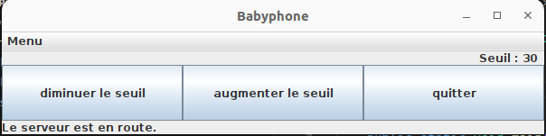

# Babyphone : client  

Interface graphique pour la réception de données d'un micro distant. Le serveur distant se démarre en ssh au lancement du programme. 
Un seuil audio permet de définir le niveau de détection sonore pour la ligne de sortie audio.    

## configuration   

Le serveur doit être installé. Renseigner les différents champs du fichier configuration.Constantes. Les valeurs pour l'audio doivent être identiques à celles du serveur.    

Une librairie externe est nécessaire pour la connexion ssh : JSch - java Secure channel.  
Version utilisée : jsch-0.1.55.jar

## lancement : 

La méthode main est dans la classe App.java .  

### fichier .sh et .bat   
Destinés à mon usage pour le développement et le test. Les tests dépendent de la configuration et ne sont pas fournis.